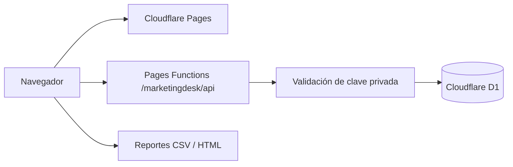

# Marketing Desk


**Campañas, contenidos, métricas y coordinación en un mismo espacio.** Una herramienta fullstack para convertir el trabajo diario de marketing en decisiones con contexto.

[**Explorar online →**](https://diegogutierrez.pages.dev/marketingdesk/) · [Wiki](https://github.com/DimaGutierrez/marketingdesk/wiki) · [Discussions](https://github.com/DimaGutierrez/marketingdesk/discussions) · [Reportar un problema](https://github.com/DimaGutierrez/marketingdesk/issues)


## El problema

Una campaña puede tener el presupuesto en una planilla, las piezas en una carpeta, el seguimiento de la agencia en mensajes y los resultados en otro reporte. Marketing Desk reúne esos elementos para responder tres preguntas: **¿qué estamos haciendo, quién tiene el próximo paso y qué resultados estamos viendo?**

## Probalo en un minuto

1. Abrí [Marketing Desk](https://diegogutierrez.pages.dev/marketingdesk/).
2. Elegí **Explorar ejemplo sin clave**: los datos son ficticios y el recorrido es de solo lectura.
3. Revisá campañas, agenda de contenidos, tareas, indicadores e iniciativas.
4. Contanos en [Discussions](https://github.com/DimaGutierrez/marketingdesk/discussions) qué cambiarías para usarlo en tu trabajo.

El espacio operativo requiere una clave privada. Guarda datos y adjuntos en **Cloudflare D1** y ejecuta su API en **Cloudflare Pages Functions**. No depende de una computadora personal encendida.

## Qué podés hacer

| Área | Trabajo que resuelve |
| --- | --- |
| Campañas | Definir canal, objetivo, responsable, fechas, presupuesto y CPA objetivo. |
| Contenidos | Planificar piezas, adjuntar archivos, revisar estados y registrar el enlace publicado. |
| Equipo | Asignar responsables, agencia/proveedor, prioridades, vencimientos y bloqueos. |
| Métricas | Cargar resultados diarios manualmente o importar CSV con validación previa. |
| Reportes | Filtrar por período y campaña; exportar CSV y un reporte HTML independiente. |
| Iniciativas | Priorizar hipótesis y documentar resultados de experimentos. |
| Respaldo | Descargar registros, métricas, historial y adjuntos en JSON. |

**Carga manual y CSV, sin APIs publicitarias ni servicios de IA pagos.** La aplicación registra y ayuda a coordinar el trabajo; no publica anuncios ni modifica presupuestos en plataformas externas. Los responsables son etiquetas de un único espacio compartido, no cuentas con permisos individuales.

## Indicadores transparentes

CTR = clics / impresiones × 100 · CPC = inversión / clics · CPL = inversión / leads · CPA = inversión / conversiones · ROAS = ingresos atribuidos / inversión.

Se calculan sobre las sumas del período, no sobre promedios de porcentajes. Un denominador cero se muestra como “—”. La atribución la aporta quien carga los datos: **no hay deduplicación entre plataformas ni inferencia causal**. Las alertas señalan gasto sobre presupuesto o CPA sobre objetivo y siempre requieren criterio humano.

## CSV sin duplicaciones

Descargá la plantilla desde la aplicación: incluye los identificadores de tus campañas.

```csv
campaign,day,impressions,clicks,leads,conversions,spend_cents,revenue_cents
ID_DE_CAMPANA,2026-09-30,10000,500,50,10,2000000,6000000
```

Los formularios usan pesos argentinos; el CSV usa **centavos de ARS**. Una combinación campaña/fecha identifica un registro. Al importar de nuevo se reemplaza, no se suma. La vista previa informa los reemplazos y una fila inválida rechaza toda la importación. [Guía detallada](wiki/Guia-de-uso.md).

## Arquitectura



- JavaScript nativo y módulos ES; sin framework ni CDN de terceros en la interfaz.
- SQL parametrizado, validación en servidor y escrituras agrupadas para importar métricas.
- Edición con control de versión para detectar cambios concurrentes.
- Clave almacenada como secreto de Cloudflare y conservada sólo en memoria del navegador durante la sesión.
- Adjuntos divididos en fragmentos para almacenarlos y recuperarlos desde D1.
- Ruta acotada: las páginas existentes del portfolio siguen sirviéndose como archivos estáticos.

## Código y pruebas

Node.js 24 o superior. No necesitás instalar dependencias para construir y ejecutar las pruebas:

```sh
npm run build
npm test
```

Las pruebas cubren validación, CSV con comillas, rechazo de duplicados, autenticación, edición concurrente, persistencia, importación atómica, adjuntos y respaldo. El despliegue se documenta en [Arquitectura y despliegue](wiki/Arquitectura-y-despliegue.md). **Nunca publiques tu clave ni la carpeta de datos.**

## Alcance y límites

Pensado para un espacio pequeño: hasta 2.000 registros de planificación, 10.000 registros diarios de métricas, 2.000 filas por CSV, 5 MB por adjunto y 20 MB de adjuntos en total. Estos límites de aplicación no sustituyen las cuotas de Cloudflare. No se activó una suscripción paga para este proyecto. [Condiciones del plan D1](https://developers.cloudflare.com/d1/platform/pricing/).

La demostración pública usa datos ficticios de solo lectura. No es un producto multiempresa con registro de usuarios, publicación automática, conectores publicitarios ni análisis generativo. [Seguridad](SECURITY.md).

## Construyámoslo con problemas reales

- ¿Qué métrica cambió una decisión tuya esta semana?
- ¿Dónde se demora más una campaña: brief, producción, aprobación o medición?
- ¿Qué mejora te ahorraría una hora de trabajo?

Abrí una discusión con tu contexto y un ejemplo sin datos confidenciales. Si el proyecto te resulta útil, una ⭐ ayuda a que otras personas lo descubran. [Cómo contribuir](CONTRIBUTING.md).

## About this project

Marketing Desk is an open-source marketing operations workspace built with JavaScript, Cloudflare Pages Functions and D1. It combines campaign planning, content tracking, team tasks, CSV analytics and explainable reporting. The public walkthrough is read-only; the private workspace persists real data in the cloud.

Creado por [Diego Gutierrez](https://github.com/DimaGutierrez) como puente entre operaciones de marketing y desarrollo fullstack/backend. [Portfolio](https://diegogutierrez.pages.dev/).

MIT License. Las ilustraciones promocionales fueron creadas con generación de imágenes; no representan capturas ni resultados de campañas reales.
